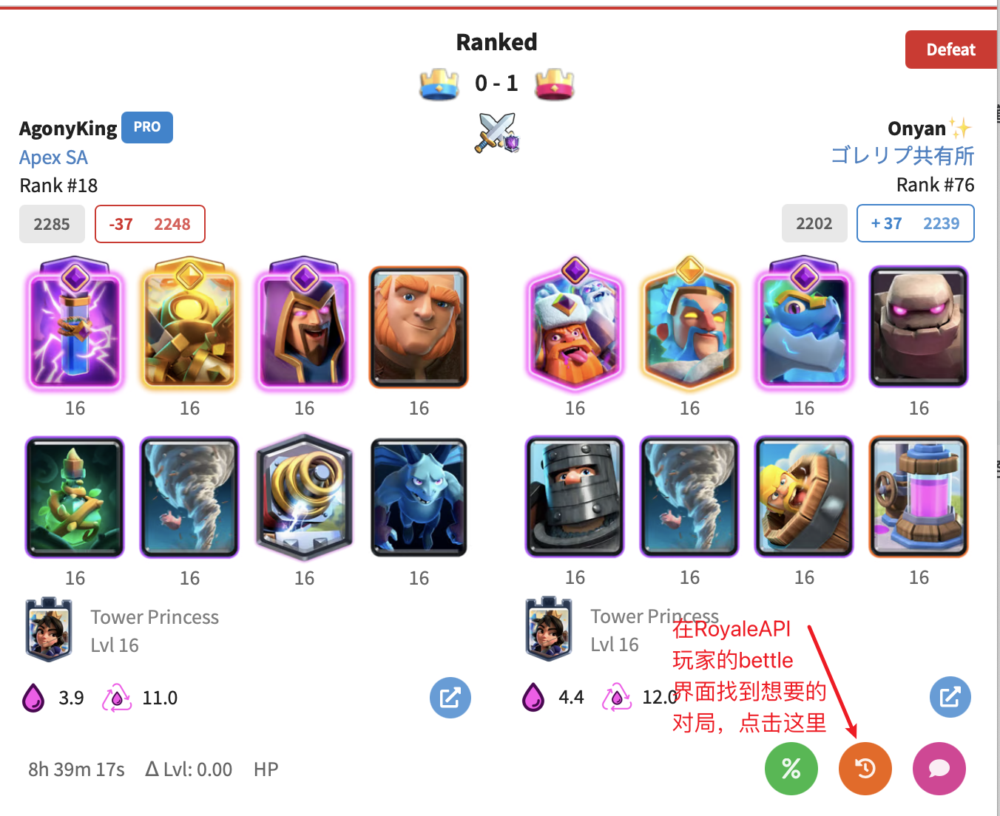
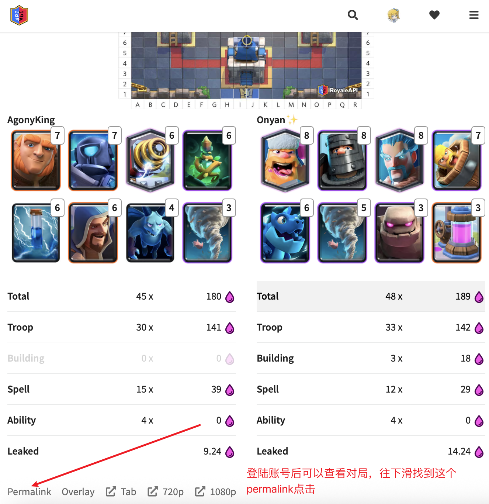
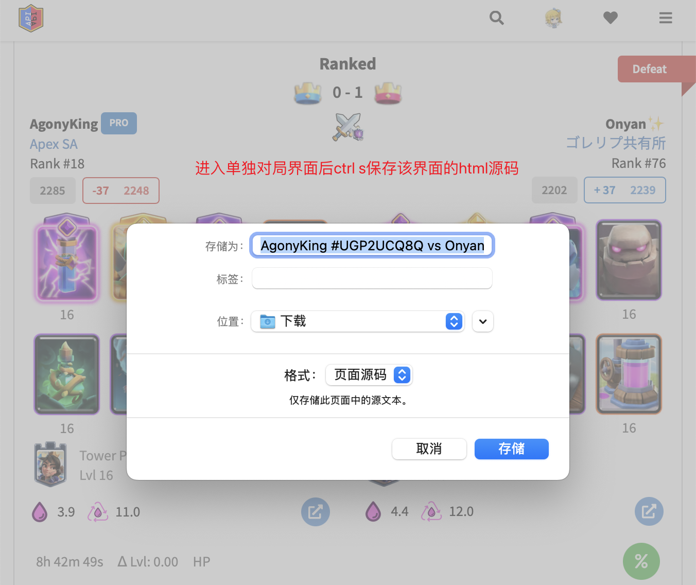

# Clash Royale Replay Studio

导入保存的 RoyaleAPI **独立对局 HTML**，在 Mac MuMu 中通过 Nulls Royale 原生游戏画面观看回放。支持暂停、时间轴瞬间跳转和 0.25×～16× 倍速。

当前为 **Mac Apple Silicon 公开测试版**。暂不支持 Windows、Intel Mac 或任意最新版 Nulls。

## 下载与使用

从 [Releases](https://github.com/ak1NaN/ClashRoyale-replay-studio/releases) 下载 `ReplayStudio-macOS-arm64.zip`，解压打开 `.app`。**无需安装 Python、Qt、Frida 或 Android SDK。**

1. 手动启动 Mac MuMu，开启模拟器 root，等待安卓桌面就绪。
2. 安装 Nulls Royale **15.535.13**，完成首次联网资源下载；已验证资源为 **15.535.86**。建议随后退出游戏。
3. 打开 Replay Studio，导入 HTML，点击 **准备回放**。
4. 程序自动使用 MuMu 的 ADB、部署配套组件、让游戏断网，先无画面演算并缓存整场，再打开游戏回放画面。
5. 播放、暂停或拖动时间轴；换局时重新导入 HTML。
6. 正常退出会清理缓存、停止 Frida、恢复游戏联网并打开普通游戏。

仅导入 HTML 不会断网。程序不会下载游戏、升级游戏或自动启动模拟器。多实例、非标准安装路径时，在连接设置中指定 ADB 和端口；默认端口为 `127.0.0.1:16384`。[MuMu 官方 ADB 说明](https://www.mumuplayer.com/help/mac/connect-adb.html)。

此测试版尚未经过 Apple Developer ID 签名与公证，首次下载可能被 macOS 阻止。请核对来源，使用系统提供的正常允许打开流程；程序不会关闭系统安全设置。

## 如何从 RoyaleAPI 获取对局 HTML

**1. 找到要观看的对局。** 在 RoyaleAPI 玩家页面的 Battles（对战记录）中找到目标对局，点击图中橙色回放按钮。如果网站要求登录，请先登录。



**2. 打开独立对局页面。** 展开回放后向下滚动，在统计表下方点击 **Permalink**，进入只包含这一局的页面。



**3. 保存 HTML 并导入。** 等待独立对局页面加载完成，在 Mac 上按 **⌘S**（Windows 为 Ctrl+S）。如图选择 **页面源码**；其他浏览器可选择 **网页，仅 HTML**。保存为 `.html` 文件，然后在 Replay Studio 中点击 **导入 HTML** 选择它。



截图中的快捷键标注为 Ctrl+S，Mac 请使用 ⌘S。请保存独立对局页面的 HTML，不要保存为 PDF、截图或 `.webarchive`，也不要保存整个玩家的对战列表页。

## 仓库结构

本仓库只维护回放应用。训练观测、批量客户端、手动演示脚本和旧部署入口已移除。

```text
app/          回放应用代码、卡牌表和界面资源
resources/    编译好的原生探针、兼容版本和依赖校验信息
tools/        下载构建依赖和打包 Mac 应用
docs/         获取对局 HTML 的三张教程截图
tests/        回放功能回归测试
licenses/     上游与第三方许可、归属说明
run.py        源码启动入口
requirements.txt  应用依赖
```

| `app/` 中的文件 | 作用 |
| --- | --- |
| `gui.py` | 窗口、导入、时间轴、倍速和工作线程 |
| `runtime.py` | 预演算、逐 tick 缓存、播放、换局和退出清理 |
| `device.py` | MuMu 连接、root、Frida 安装、版本检查、断网及注入 |
| `importer.py` | 卡牌/等级/形态校验、方向转换、相容初手计算 |
| `html_events.py` | 从保存的 HTML 提取出牌和技能事件，不执行网页脚本 |
| `engine.py` | 回放所需的引擎通信、初始化和播放控制 |
| `protocol.py` | 解析原生状态和手牌等数据 |
| `match_config.py`、`standard_match.json` | 构造对局配置 |
| `catalog.json` | 卡牌 ID、别名、稀有度和形态映射 |
| `icon.png`、`__init__.py` | 图标及 Python 包标记 |

`resources/libcrprobe.so` 是真正执行游戏逻辑的原生探针。当前版本与已验证引擎一致，未修改原生战斗逻辑。
原生源码、编译脚本及上游测试保存在固定的 [v0.1.0 引擎基线](https://github.com/ak1NaN/ClashRoyale-replay-studio/tree/v0.1.0-macos-preview/vendor/firstlight)，其源码和二进制哈希记录在 `resources/provenance.json`。以后适配游戏版本时在引擎工程修改并编译，再更新这里的探针和兼容清单。

## 从源码开发

普通用户可以直接下载 Release 应用。运行源码需要 **Apple Silicon Mac 和 ARM64 Python 3.12**。下载 GitHub 的 **Source code (zip)** 并解压，在终端进入解压后的仓库根目录（能看到 `run.py` 和 `requirements.txt` 的目录）。

**直接运行源码：**

```sh
python3.12 -m venv .venv
arch -arm64 .venv/bin/python -m pip install -r requirements.txt
arch -arm64 .venv/bin/python tools/fetch_deps.py
arch -arm64 .venv/bin/python run.py
```

第一次安装依赖和下载 Frida 需要联网。若提示 `python3.12: command not found`，请先安装 Python 3.12 的 macOS 版本。无需自行编译原生探针，仓库已包含配套文件。

启动前先打开 MuMu、开启 root，并准备好上文列出的匹配游戏版本及资源。窗口打开后导入独立对局 HTML，点击 **准备回放**。以后再次运行只需在同一目录执行最后一条命令。

**可选：测试和打包为独立 App。** 仅打包时需要 PyInstaller：

```sh
arch -arm64 .venv/bin/python -m pip install -r tools/requirements.txt
arch -arm64 .venv/bin/python -m unittest discover -s tests
# 关闭待覆盖的应用后打包
arch -arm64 .venv/bin/python tools/package.py
```

Frida 固定版本、官方来源和哈希见 `resources/frida.json`。构建时下载，应用运行时不下载依赖。打包过程自动清理中间文件。发布压缩包：

```sh
ditto -c -k --keepParent 'dist/Replay Studio.app' dist/ReplayStudio-macOS-arm64.zip
shasum -a 256 dist/ReplayStudio-macOS-arm64.zip
```

源码设置在 `data/`，独立应用默认在 `~/Library/Application Support/ReplayStudio/`；可通过 `REPLAY_STUDIO_DATA` 覆盖。逐 tick 缓存只在内存中，换局和正常退出清理。

## 兼容边界

- 需要 ARM64 Android、root、匹配的 `libg.so` 和资源；游戏更新后可能需要重新适配引擎，不能只改版本号。
- HTML 缺少原始随机种子与秘密初手，因此这是相容的重建模拟，不能保证每局的时间、伤害和结局与原局完全一致。
- 缓存上限为 256 MiB 序列化状态，最多演算到游戏时钟 6 分钟；遇到不支持的卡牌或失败动作会停止。
- 本地已验证 MuMu 1.4.11 上的组件部署、连续两局、精确跳转和退出恢复；尚未完成另一台干净 Mac 的分发验证。

基于 [Clash-Royale-Battle-Engine](https://github.com/Jason-XII/Clash-Royale-Battle-Engine) 与 [FirstLight CR](https://gitlab.com/firstlight3/FirstLight_CR)。本仓库目前为公开测试版本，暂未为项目整体指定开源许可证。上游和第三方组件的许可保留在 `licenses/`。不包含游戏、MuMu、玩家 HTML 或个人设置，不隶属于 Supercell。
